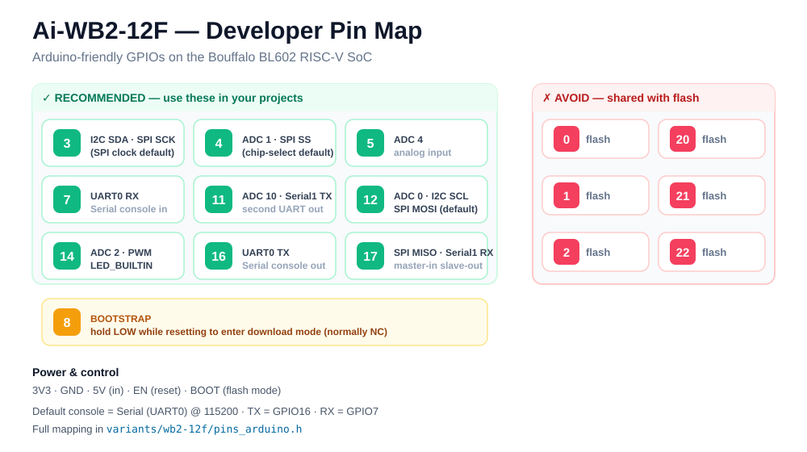

<div align="center">

🌐 **English** · [**简体中文**](./README_zh-CN.md)

</div>

<p align="center">
  
</p>

<div align="center">

[](https://github.com/XEMOWO/AiWB2-BL602-Arduino-Core/releases)
[](LICENSE)
[](#installation)
[](https://www.arduino.cc/en/software)
[](https://en.bouffalolab.com/)
[](#specifications)
[](#specifications)
[](#specifications)

**A modern Arduino core for the Ai-Thinker Ai-WB2-12F (Bouffalo BL602)** — a RISC-V SoC with WiFi 802.11 b/g/n and BLE 5.0.

Write **ESP32-style sketches**, install the core in **one click** from the Boards Manager, and upload over UART with the bundled flasher — no toolchain setup, no SDK download, nothing to configure.

</div>

---

## ✨ Highlights

| | |
|---|---|
| 🚀 **One-click install** | The package is **fully self-contained** — the RISC-V toolchain and all SDK headers ship inside the zip. Arduino IDE downloads, extracts, and you're ready. |
| 🧩 **ESP32-style API** | Port your existing sketches: the same `Serial`, `Wire`, `SPI`, `EEPROM`, `Preferences`, `WiFi` and `BLE` API you already know. |
| ✅ **Verified on real silicon** | `Serial`, PWM, ADC, SPI, external interrupts and EEPROM are all tested on actual Ai-WB2-12F hardware — not just sim-built. |
| 🗂️ **25 example sketches** | From `Blink` to `DS18B20`, NeoPixel, IR (NEC), Servo and an ST7789 TFT driver — real-world code included. |
| 🪶 **Thin, reliable layer** | The Arduino API sits on the vendor's battle-tested `bl_iot_sdk` — we don't reinvent silicon drivers, so flash/RAM stay lean. |
| 📻 **One chip does it all** | WiFi + BLE + rich analog/GPIO on a 192 MHz RISC-V core, all in one low-cost module. |

## 📊 Specifications

| | |
|---|---|
| **SoC** | Bouffalo BL602 |
| **Core** | RISC-V RV32IMFC @ 192 MHz |
| **Radio** | WiFi 802.11 b/g/n · BLE 5.0 |
| **Memory** | 2 MB flash · 276 KB SRAM |
| **GPIO** | 22 pins (9 recommended for Arduino projects) |
| **ADC** | 5 × 12-bit channels |
| **Serial · I²C · SPI · PWM** | 2 × UART · 1 × I²C · 1 × SPI · 5-ch hardware PWM |

## 🛠️ Installation

> [!IMPORTANT]
> Add this URL in Arduino IDE 2.x: **File → Preferences → Additional boards manager URLs**

```
https://github.com/XEMOWO/AiWB2-BL602-Arduino-Core/releases/download/v0.1.0/package_aiwb2_index.json
```

Then:

1. **Tools → Board → Boards Manager** → search **Ai-WB2** → **Install**.
2. Select **Tools → Board → Ai-Thinker Ai-WB2-12F**.
3. Connect the board (USB-UART on `GPIO16` TX / `GPIO7` RX) and hit **Upload**.

> [!TIP]
> On **Windows** everything is bundled — RISC-V toolchain, SDK headers and the flasher — so the install works fully offline. On macOS/Linux the Arduino layer is cross-platform; supply your own native `riscv64-unknown-elf-*` toolchain and it works the same.

## 💡 First sketch

```cpp
#include <Arduino.h>

void setup() {
  Serial.begin(115200);
  pinMode(LED_BUILTIN, OUTPUT);
  Serial.println("Hello from Ai-WB2-12F!");
}

void loop() {
  digitalWrite(LED_BUILTIN, HIGH);
  delay(500);
  digitalWrite(LED_BUILTIN, LOW);
  delay(500);
}
```

## 📍 Pin map

<p align="center">
  
</p>

Nine GPIOs are recommended for Arduino projects. The six flash-shared pins (`0, 1, 2, 20, 21, 22`) are used by the internal flash — avoid them. `GPIO8` is the bootstrap pin (hold LOW while resetting to enter download mode).

## 📦 Peripherals

| Peripheral | API | Example | Status |
|---|---|---|---|
| GPIO / digital I/O | `pinMode` · `digitalWrite` · `digitalRead` | `Blink` | ✅ verified |
| Timing | `millis` · `micros` · `delay` | — | ✅ verified |
| Serial (UART0) | `HardwareSerial` | `SerialEcho` | ✅ verified |
| Serial1 (UART1) | `HardwareSerial(1)` | `Serial1Echo` | 🟢 implemented |
| PWM | `analogWrite` | `PwmFade` | ✅ verified |
| ADC (5 channels) | `analogRead` | `AnalogReadVoltage` | ✅ verified |
| I2C | `Wire` | `ScanAndProbe` | 🟢 implemented |
| SPI | `SPIClass` | `SpiLoopback` · `St7789Test` | ✅ verified |
| External interrupts | `attachInterrupt` | `ButtonInterrupt` | ✅ verified |
| EEPROM (flash) | `EEPROM` | `EepromCounter` | ✅ verified |
| NVS-style store | `Preferences` | `PreferencesCounter` | 🟢 implemented |
| Tone / pulse | `tone` · `pulseIn` | `ToneMelody` | 🟢 implemented |
| Timers · WDT · RTC | `timer_*` · `watchdog*` · `rtc_*` | `TimerAndWatchdog` | 🟢 implemented |
| WiFi | `WiFi` (ESP32-style) | `WiFiConnect` | 🟢 implemented |
| BLE 5.0 GATT | `BLE` | `BlePeripheral` | 🟢 implemented |
| Servo | `Servo` | `Sweep` | 🟢 implemented |
| SoftwareSerial | `SoftwareSerial` | `SoftwareSerialEcho` | 🟢 implemented |
| 1-Wire | `OneWire` | `DS18B20` | 🟢 implemented |
| NeoPixel | Adafruit-compatible | `RGBLoop` | 🟢 implemented |
| IR (NEC) | `IRremote` | `IRSender` · `IRreceive` | 🟢 implemented |
| Strings · Math · Stream | `String` · `map` · `Stream` | `StringAndMath` | ✅ verified |

**Legend** — ✅ = compiled **and verified on real Ai-WB2-12F hardware** · 🟢 = implemented, compiled through our IDE-simulated build, hardware test still open.

## 📂 Examples

All 25 examples live in `libraries/AiWB2/examples/` and appear under **File → Examples → AiWB2**:

`Blink` · `SerialEcho` · `SerialBanner` · `Serial1Echo` · `PwmFade` · `AnalogReadVoltage` · `ScanAndProbe` · `SpiLoopback` · `St7789Test` · `ButtonInterrupt` · `EepromCounter` · `ToneMelody` · `TimerAndWatchdog` · `PreferencesCounter` · `StringAndMath` · `WiFiConnect` · `BlePeripheral` · `Sweep` · `SoftwareSerialEcho` · `DS18B20` · `RGBLoop` · `IRSender` · `IRreceive`

## 🔬 Verified on real hardware

Every ✅ in the table above was tested on an actual Ai-WB2-12F:

- **Serial** — bidirectional echo at 115200 baud (`SerialEcho`)
- **PWM** — smooth breathing LED on `GPIO14` (`PwmFade`)
- **SPI** — drove an **ST7789 TFT at 8 MHz** (`St7789Test`)
- **ADC** — reads `0…4095` from a potentiometer on `GPIO12` (`AnalogReadVoltage`)
- **Interrupts** — button counter with `FALLING` edge on `GPIO11` (`ButtonInterrupt`)
- **EEPROM** — counter value **survives power cycles** across resets (`EepromCounter`)

## 🧱 What's in the box

| Path | Contents |
|---|---|
| `cores/arduino/` | Arduino API implementation (GPIO, Serial, PWM, ADC, timers, interrupts…) |
| `variants/wb2-12f/` | Board pin mapping (`pins_arduino.h`) |
| `libraries/` | 12 libraries + 25 example sketches |
| `lib/` | Prebuilt SDK static libraries |
| `sdk-include/` | SDK headers + linker script (generated at package time) |
| `tools/riscv-msys/` | Minimal RISC-V toolchain for Windows (bundled) |

## 📄 License

[Apache-2.0](./LICENSE) · third-party notices in [`THIRD_PARTY_LICENSES.md`](./THIRD_PARTY_LICENSES.md). The Arduino layer wraps the vendor's `bl_iot_sdk` (Apache-2.0) — no proprietary silicon-driver code is reimplemented.

---

<div align="center">

Made with 💙 for the Ai-Thinker & Bouffalo community — [简体中文](./README_zh-CN.md) · [Report an issue](https://github.com/XEMOWO/AiWB2-BL602-Arduino-Core/issues)

</div>
